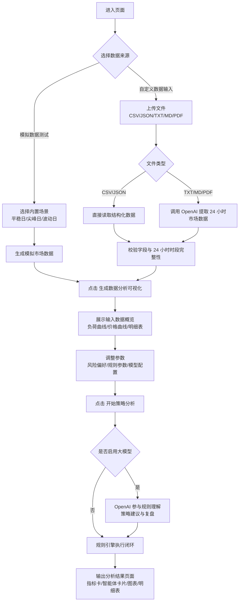
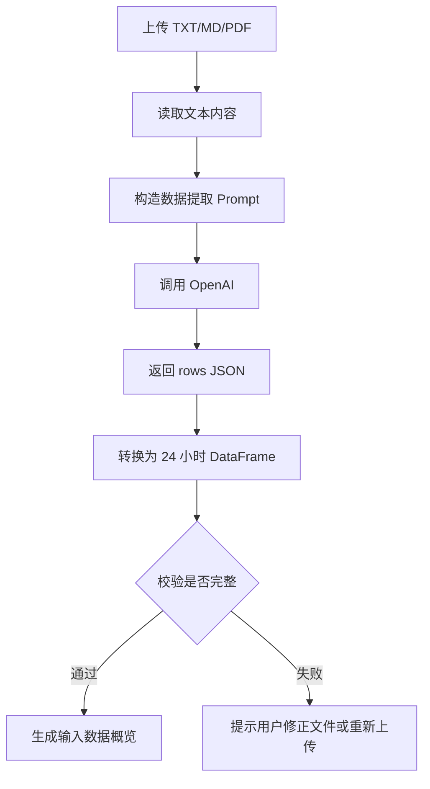

# Workflow Logic

这个文件用 Mermaid 描述当前系统的页面流程和后端分析闭环，方便直接放到 GitHub 或答辩材料里使用。

## 页面与数据流程

## 智能体闭环流程

## 文本文件提取流程

## 说明

- 页面现在是两阶段流程：先看输入数据，再做策略分析。
- 自定义文件里如果是结构化数据，系统直接读取；如果是文本或 PDF，系统会先让大模型提取数据。
- 大模型主要参与：规则理解、策略建议、复盘优化。
- 确定性计算主要负责：申报电量、结算成本、偏差率和最终收益计算。
